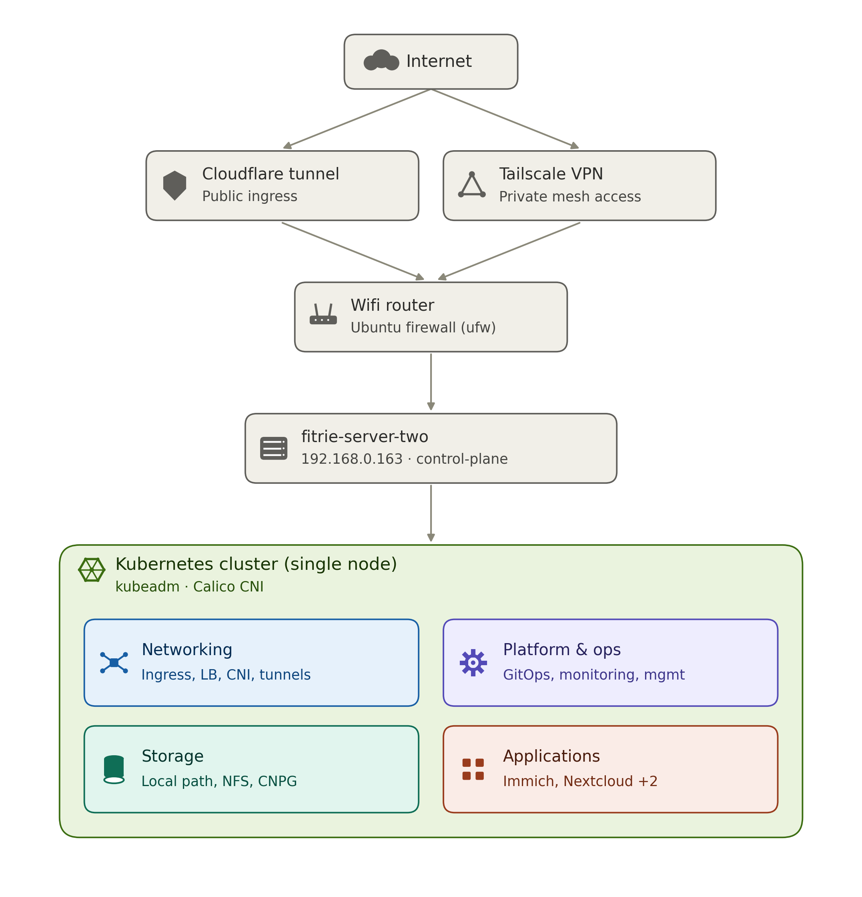

An overview of my homelab Kubernetes.

## Overview

A single-node cluster bootstrapped with `kubeadm`, running on a bare-metal Ubuntu host. It hosts everything from photo backup to a self-hosted password manager, all behind either a Cloudflare tunnel or a Tailscale mesh depending on whether the app needs to be public.

## Host

| Field | Value |
| --- | --- |
| Hostname | `fitrie-server-two` |
| Role | control-plane (single node, no separate workers) |
| LAN IP | `192.168.0.163` |
| OS / firewall | Ubuntu, `ufw` |
| Bootstrap | `kubeadm` |

## Network & remote access

Two independent paths into the cluster, kept separate so one going down doesn't take the other with it:

- **Cloudflare Tunnel** (`cloudflare` namespace) — an outbound-initiated connection to Cloudflare's edge, used to expose public-facing apps without opening any inbound ports on the router.
- **Tailscale** (`tailscale` namespace) — a private mesh VPN, used for admin access and anything that shouldn't be public.

Both sit behind the home wifi router and the host's own `ufw` firewall.

## Cluster components

### CNI

Calico, managed by the Tigera operator — `calico-system`, `tigera-operator`.

### Networking

`ingress-nginx` handles HTTP routing, `metallb-system` provides LoadBalancer IPs on bare metal, plus the `cloudflare` and `tailscale` connector namespaces.

### Platform & ops

`argocd` for GitOps-driven deployments, `monitoring` for observability, `management` for cluster admin tooling, plus the built-in `kube-system`, `kube-public`, `kube-node-lease`, and `default` namespaces.

### Storage

`local-path-storage` for node-local volumes, `nfs-provisioner` for NFS-backed persistent volumes, and `cnpg-system` / `cnpg-database` running CloudNativePG for Postgres.

### Applications

| Namespace | App |
| --- | --- |
| `immich` | Photo & video backup |
| `nextcloud` | File sync & storage |
| `vaultwarden` | Password manager |
| `money-tracker` | Personal budget tracker |

## Notes

- All app namespaces sit behind `ingress-nginx`, fronted by either the Cloudflare tunnel (public apps) or Tailscale (private/admin apps).
- Being single-node, the control-plane and every workload share the same host — there's no separate worker pool to spread load across.